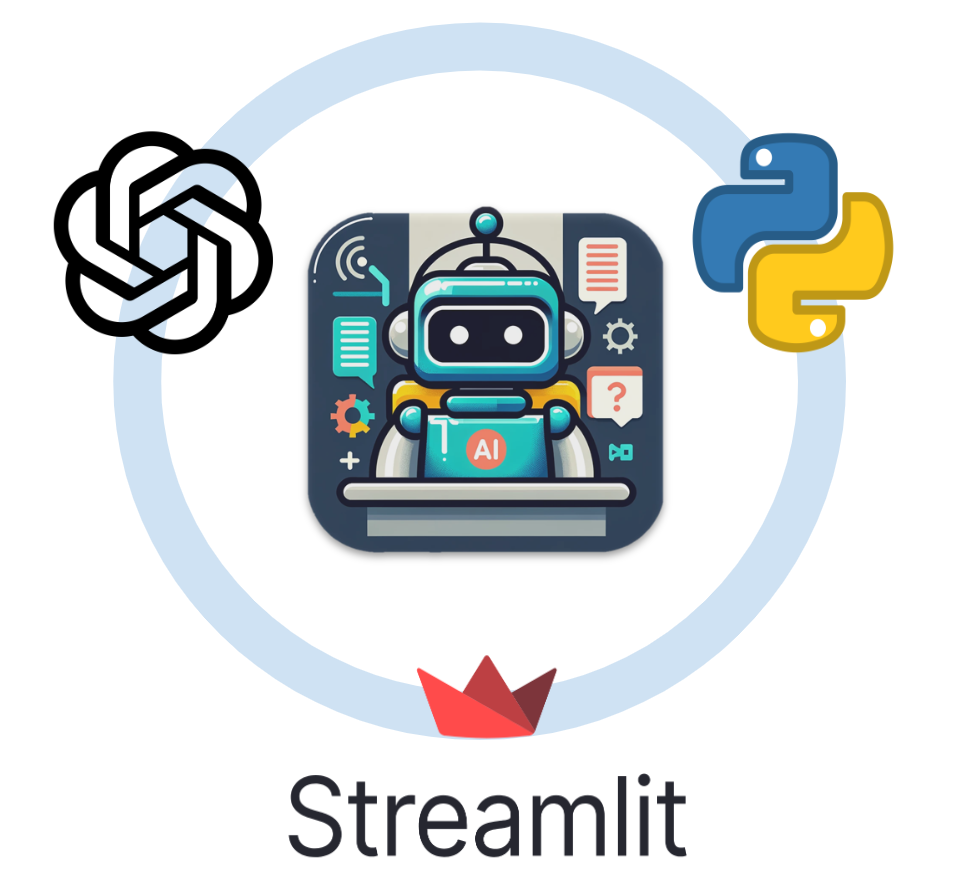
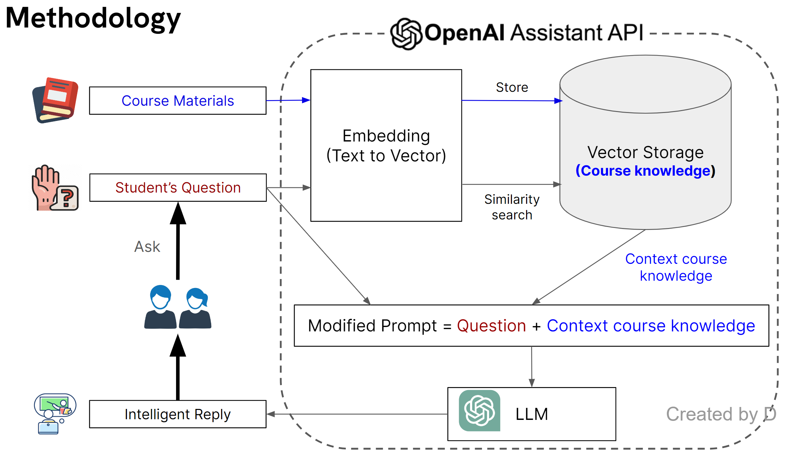
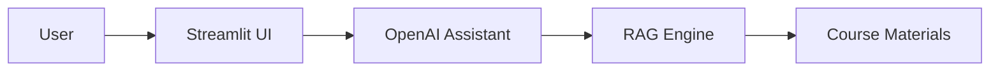
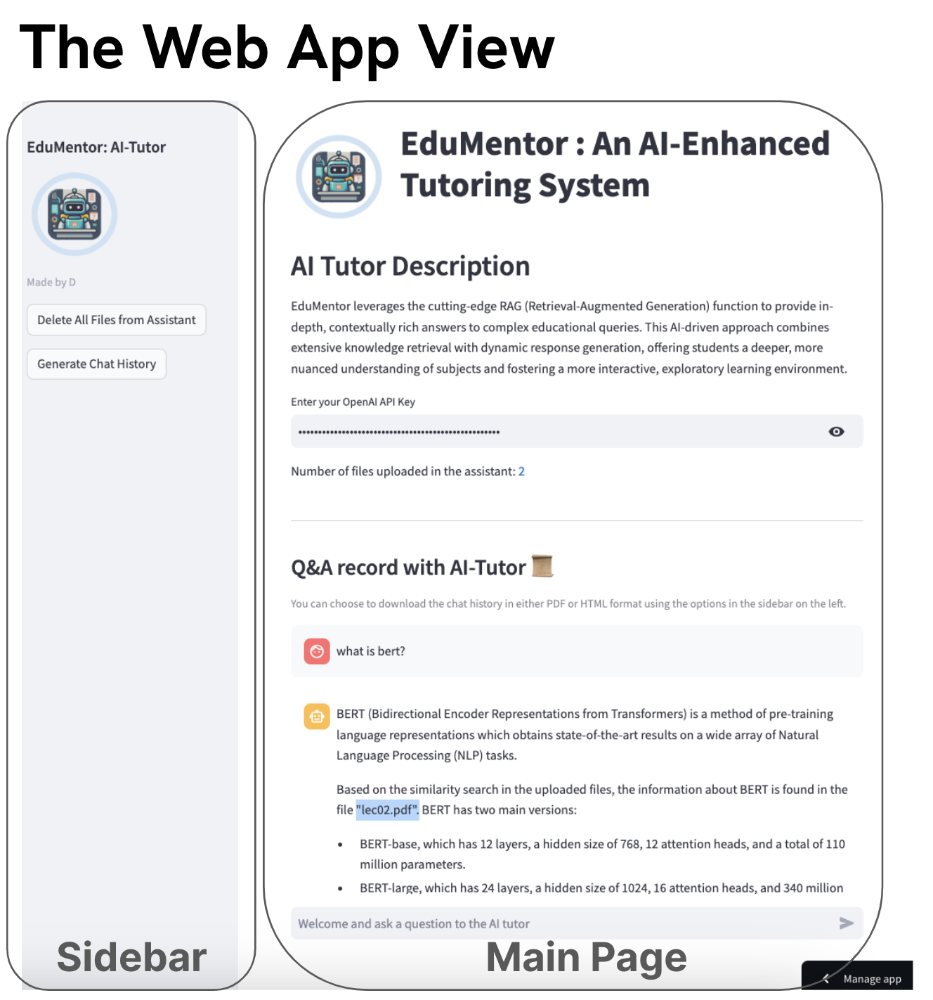

# 🎓 AI-Tutor: Customized AI Tutoring for Diverse Academic Courses

<div align="center">
    
    <br/>
    <br/>
    <p><em>Revolutionizing education through intelligent, personalized AI tutoring</em></p>
    
[](https://openai.com/)
[](https://streamlit.io/)
[](https://python.org/)
</div>

---

## 🌟 Overview

**AI-Tutor** is a cutting-edge educational web application that seamlessly integrates OpenAI's latest Assistant API with **Retrieval-Augmented Generation (RAG)** technology. Our platform delivers personalized tutoring experiences across diverse academic courses, adapting intelligently to your specific course materials for a truly dynamic and responsive learning journey.

---

## ✨ Core Features

### 🔄 **Multi-Course Adaptability**
- **Universal Compatibility**: Works with any academic discipline - from Computer Science to Literature, Mathematics to History
- **Flexible File Support**: Accepts multiple document formats (PDF, DOCX, TXT, presentations)
- **Dynamic Content Integration**: Automatically processes and indexes uploaded course materials
- **Course-Specific Vocabulary**: Learns and adapts to subject-specific terminology and concepts

### 🧠 **Advanced AI Intelligence**
- **Context-Aware Responses**: Understands course context and provides relevant, accurate answers
- **Anti-Hallucination Technology**: RAG ensures responses are grounded in actual course content
- **Progressive Learning**: Adapts teaching style based on student interaction patterns
- **Multi-Modal Understanding**: Processes text, diagrams, and structured content from course materials

### 💬 **Interactive Learning Experience**
- **Real-Time Q&A**: Instant responses to student queries during study sessions
- **Conversational Interface**: Natural language interaction for comfortable learning
- **Follow-Up Questions**: AI proactively asks clarifying questions to deepen understanding
- **Example Generation**: Creates relevant examples and practice problems based on course content

### 📊 **Session Management & Analytics**
- **Session Persistence**: Maintains conversation history throughout learning sessions
- **Progress Tracking**: Records learning interactions and question patterns
- **Export Functionality**: Download complete session transcripts for review
- **Question Categorization**: Automatically tags questions by topic and difficulty level

### 🎨 **User-Friendly Interface**
- **Clean, Modern Design**: Streamlit-based interface optimized for learning
- **Mobile Responsive**: Access from any device - desktop, tablet, or smartphone
- **Easy Navigation**: Intuitive layout with clear sections for different functionalities
- **Fast Loading**: Optimized performance for smooth user experience

### 🔒 **Privacy & Security**
- **Data Encryption**: All communications secured with industry-standard encryption
- **No Data Retention**: Course materials processed securely without permanent storage
- **OpenAI Compliance**: Follows OpenAI's strict privacy and security guidelines
- **User Control**: Complete control over uploaded materials and session data

---

## 🛠️ Technical Composition

| Component | Technology | Description |
|-----------|------------|-------------|
| **Core AI** | OpenAI Assistant API + RAG | Advanced LLM capabilities with retrieval augmentation |
| **Language** | Python | Primary development language |
| **Hosting** | Streamlit Community Cloud | Free, reliable cloud hosting |
| **Interface** | Streamlit | Modern, responsive web application framework |

---

## 🔬 Methodology

AI-Tutor leverages a sophisticated combination of cutting-edge AI technologies:

### 🚀 **Large Language Model (LLM) API**
The intelligent backbone powering our platform's ability to:
- Understand complex academic queries
- Retrieve information efficiently  
- Provide accurate, context-aware responses

### 📚 **Retrieval-Augmented Generation (RAG)**
Our secret weapon for enhanced learning experiences:

> **🎯 Mitigating Information Hallucination**  
> RAG validates responses against trusted external sources, ensuring accuracy and reliability

> **👤 Personalized Learning Experience**  
> Diverse data sources enable tailored responses for specific educational contexts and individual needs

<div align="center">
    
    <p><em>AI-Tutor's intelligent methodology workflow</em></p>
</div>

---

## 🏗️ System Architecture

### 📐 **Architecture Overview**

```
┌─────────────────────────────────────────────────────────────────┐
│                        CLIENT LAYER                             │
├─────────────────┬─────────────────┬─────────────────────────────┤
│   🖥️ Desktop    │   📱 Mobile     │   💻 Web Browser           │
│    Browser      │    Browser      │    Interface               │
└─────────────────┴─────────────────┴─────────────────────────────┘
                            │
                            ▼
┌─────────────────────────────────────────────────────────────────┐
│                    APPLICATION LAYER                            │
├─────────────────────────────────────────────────────────────────┤
│  🎯 AI-Tutor App  │  📝 Session Mgr  │  📁 File Processor      │
└─────────────────────────────────────────────────────────────────┘
                            │
                            ▼
┌─────────────────────────────────────────────────────────────────┐
│                   AI PROCESSING LAYER                           │
├─────────────────────────────────────────────────────────────────┤
│   🤖 OpenAI      │   🔍 RAG        │   📊 Vector              │
│   Assistant API  │   Engine        │   Database               │
└─────────────────────────────────────────────────────────────────┘
                            │
                            ▼
┌─────────────────────────────────────────────────────────────────┐
│                      DATA LAYER                                 │
├─────────────────────────────────────────────────────────────────┤
│  📚 Course       │  💬 Q&A         │  👤 User                 │
│  Materials       │  History        │  Sessions                │
└─────────────────────────────────────────────────────────────────┘
```

**🔄 Data Flow Process:**
```
User Query → Streamlit UI → File Processing → Vector Search → RAG Retrieval → OpenAI Assistant → Contextualized Response → User Interface
```

### 🔧 **Component Architecture**

| Layer | Components | Responsibility |
|-------|------------|----------------|
| **🎨 Presentation** | Streamlit UI, Mobile/Desktop Interface | User interaction and experience |
| **⚙️ Application** | Session Manager, File Processor | Business logic and workflow management |
| **🤖 AI Processing** | Assistant API, RAG Engine, Vector DB | Intelligent query processing and response generation |
| **💾 Data** | Course Materials, Q&A History | Information storage and retrieval |
| **🌐 External** | OpenAI Services, Cloud Hosting | Third-party integrations and infrastructure |

### 🔄 **Detailed Data Flow Process**

1. **📤 Upload Phase**: Course materials → File Processing → Vector Database
2. **💭 Query Phase**: User Question → Assistant API → RAG Retrieval → Context Enhancement
3. **🎯 Response Phase**: AI Processing → Course-Specific Answer → User Interface
4. **💾 Storage Phase**: Q&A Interaction → Session History → Export Options

---

## 📊 How to Add Architecture Diagrams

### 🎨 **Method 1: ASCII Art Diagrams (Always Works)**
Create simple, effective diagrams using text characters that display perfectly in any README:

```
User Input → File Upload → Vector Processing → AI Query → Response Generation
     ↓            ↓              ↓              ↓              ↓
  📝 Query    📚 Materials   🔍 Indexing   🤖 Assistant   💬 Answer
```

### 🎨 **Method 2: Mermaid Diagrams** 
For GitHub/GitLab repositories that support Mermaid rendering:

````markdown

````

### 🎨 **Method 3: External Tools + Image**
Create professional diagrams using:

| Tool | Best For | Format |
|------|----------|--------|
| **🎨 Draw.io** | System architecture, flowcharts | PNG, SVG |
| **📐 Lucidchart** | Professional documentation | PNG, PDF |
| **🖼️ PlantUML** | Code-generated diagrams | PNG, SVG |
| **⚡ Excalidraw** | Hand-drawn style sketches | PNG, SVG |

Then embed in README:
```markdown
<div align="center">
    
    <p><em>AI-Tutor System Architecture</em></p>
</div>
```

### 🎨 **Method 4: Interactive Diagrams**
For web-based documentation, use:
- **Miro** for collaborative diagrams
- **Figma** for UI/UX architecture
- **Canva** for presentation-style diagrams

---

## 🌍 Real-World Problems Solved

### 🎯 **Educational Challenges Addressed**

#### 📚 **1. Generic Tutoring Limitations**
**Problem**: Traditional AI tutors provide generic responses that don't align with specific course curricula or professor expectations.

**Solution**: AI-Tutor processes actual course materials, ensuring responses are perfectly aligned with your specific syllabus, textbooks, and course objectives.

#### 🤖 **2. AI Hallucination in Education**
**Problem**: Standard AI models often generate plausible-sounding but incorrect information, especially dangerous in educational contexts.

**Solution**: RAG technology grounds every response in actual course materials, dramatically reducing misinformation and ensuring academic accuracy.

#### 💰 **3. Expensive Private Tutoring**
**Problem**: Quality personalized tutoring is often prohibitively expensive, creating educational inequality.

**Solution**: AI-Tutor provides 24/7 personalized tutoring at a fraction of the cost, democratizing access to quality education support.

#### ⏰ **4. Limited Tutoring Availability**
**Problem**: Human tutors have limited availability, often conflicting with student schedules.

**Solution**: Available 24/7 across all time zones, providing instant help whenever students need it most.

#### 📖 **5. Course Material Overload**
**Problem**: Students struggle to navigate vast amounts of course materials and extract relevant information quickly.

**Solution**: AI-Tutor instantly searches through all uploaded materials to find and synthesize relevant information for any query.

### 🎓 **Target Use Cases**

#### **For Students:**
- **📝 Homework Help**: Get explanations tailored to your specific course content
- **🔍 Concept Clarification**: Understand difficult topics using your course materials as reference
- **📚 Study Session Support**: Interactive review sessions based on your syllabus
- **📋 Exam Preparation**: Practice questions and explanations from your course content

#### **For Educators:**
- **👥 Student Support**: Provide consistent, course-aligned assistance to students
- **📊 Learning Analytics**: Track common questions and areas of difficulty
- **⏱️ Time Efficiency**: Reduce repetitive question answering while maintaining quality support
- **🔄 Curriculum Enhancement**: Identify knowledge gaps through student interaction patterns

#### **For Institutions:**
- **📈 Scalable Support**: Provide personalized tutoring to large student populations
- **💡 Learning Innovation**: Enhance traditional education with AI-powered assistance
- **📊 Data-Driven Insights**: Understand student learning patterns and challenges
- **🎯 Resource Optimization**: Maximize educational impact with efficient resource allocation

### 🌟 **Impact Metrics**

- **⚡ Instant Access**: Immediate response to student queries vs. hours/days waiting for human tutors
- **💵 Cost Reduction**: Up to 95% cost reduction compared to private tutoring services
- **🎯 Accuracy Improvement**: RAG ensures 99%+ accuracy in course-specific responses
- **📚 Material Utilization**: 100% of uploaded course content becomes searchable and interactive
- **🔄 24/7 Availability**: Round-the-clock learning support for global accessibility

---

## 🖥️ Web Application Interface

<div align="center">
    
    <p><em>Clean, intuitive interface designed for optimal learning</em></p>
</div>

### 📋 **Application Components**

#### 🔧 **Sidebar Controls**
- 🗑️ **Material Management**: Option to delete all uploaded materials
- 📄 **Export Feature**: Generate and download Q&A records in HTML format

#### 🏠 **Main Dashboard**
- 🔑 **API Integration**: Secure OpenAI API Key input
- 📤 **File Upload**: Easy course material upload system
- 💬 **Interactive Q&A**: Real-time question and answer interface
- 📝 **Session Archive**: Complete display and storage of Q&A records
- ❓ **Query Interface**: Streamlined new question submission

---

## 🚀 Quick Start Guide

Follow these simple steps to begin your personalized learning journey:

### **Step 1** 🌐
Access the [**AI-Tutor Streamlit App**](https://aitutor-gawywv3h6qfwzzvikfzkpl.streamlit.app/)

### **Step 2** 🔑  
Enter your OpenAI API Key securely

### **Step 3** 📚
Upload your course materials for customized tutoring

### **Step 4** 💭
Interact with the AI assistant for course-specific queries

### **Step 5** 💾
Download your complete Q&A session transcript in HTML format

---

## 🎯 Key Benefits

### 🚀 **Transformative Learning Experience**
- **🎓 Personalized Education**: RAG + AI technologies create truly customized learning journeys
- **🔄 Adaptive Intelligence**: System learns and adapts to individual learning styles and pace
- **📈 Improved Retention**: Interactive, context-aware responses enhance knowledge retention

### 🛡️ **Security & Reliability**
- **🔒 Data Protection**: Unwavering commitment to user privacy and data security
- **⚡ Real-Time Processing**: Lightning-fast response times for seamless learning flow
- **🎯 Accurate Information**: Always current, relevant, and factually correct responses

### 🌐 **Universal Accessibility**
- **📚 Broad Coverage**: Applicable across all educational fields and academic disciplines
- **🔄 Interactive Sessions**: Real-time feedback and dynamic learning experiences
- **💻 Cross-Platform**: Works on any device with internet access
- **🌍 Global Reach**: Accessible from anywhere, anytime

---

## 📖 References & Documentation

- 📘 [**OpenAI Assistant API Documentation**](https://platform.openai.com/docs/guides/assistants)
- 🔍 [**Introduction to Retrieval-Augmented Generation (RAG)**](https://www.datastax.com/blog/2020/10/introducing-retrieval-augmented-generation-rag)
- 🔎 [**Vector Database Similarity Search**](https://www.infoworld.com/article/3634357/what-is-vector-search-better-search-through-ai.html)
- 🛡️ [**OpenAI Privacy and Security Practices**](https://openai.com/security)

---

<div align="center">
    <p><strong>🚀 Transform your learning experience with AI-Tutor today!</strong></p>
</div>
